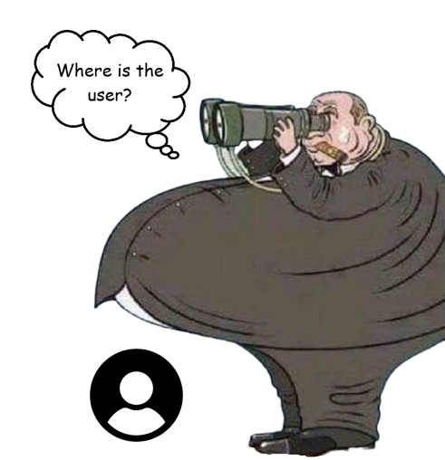

# Always Visible API

> ⚠️ DISCLAIMER: This project is intended solely for educational and research purposes. The author does not condone or support any form of malicious activity. You are fully responsible for how you choose to use this code.

Always Visible API is a browser extension that overrides web page visibility detection mechanisms. It forces websites to believe the current tab is always visible, focused, and actively engaged, effectively neutralizing all forms of page abandonment tracking.

This repository also includes:
- A robust page visibility detector.

## Features

### Visibility & Focus Override
- Forces `document.hidden` to always return `false`
- Sets `document.visibilityState` to permanently return `'visible'`
- Overrides `document.hasFocus()` to always return `true`
- Handles vendor-specific properties (webkit, moz, ms prefixes)

### Event Blocking
Prevents registration and propagation of tracking events including:
- **Visibility events**: `visibilitychange` and vendor variants
- **Focus events**: `blur`, `focus`, `focusin`, `focusout`
- **Page lifecycle events**: `pagehide`, `beforeunload`, `unload`, `pageshow`
- **Mouse events**: `mouseleave`, `mouseout`, `mouseenter`, `mouseover`, `mousemove`
- **Pointer events**: `pointerenter`, `pointerover`

### Fullscreen Simulation
- Reports `document.fullscreenElement` as always active
- Blocks fullscreen change event propagation
- Supports all vendor-specific fullscreen implementations

### Activity Simulation
- Maintains continuous `requestAnimationFrame` loop
- Regularly calls `performance.now()` at ~60fps
- Simulates constant user presence

### Network Request Blocking
- Intercepts and blocks `navigator.sendBeacon()` calls
- Filters `fetch()` requests to analytics and tracking endpoints
- Prevents exit intent data transmission

### Advanced Overrides
- **Intersection Observer**: Forces all observed elements to report as visible and intersecting
- **Window methods**: Blocks `window.blur()` and `window.focus()` calls
- **Iframe detection**: Prevents parent window detection by forcing `window.top` to equal `window`
- **Pointer lock**: Overrides `document.pointerLockElement` property

## Installation

1. Clone or download this repository
2. Open your browser's extension management page
   - Chrome: `chrome://extensions/`
   - Firefox: `about:addons`
   - Edge: `edge://extensions/`
3. Enable "Developer mode"
4. Click "Load unpacked" and select the extension directory

---

Copyleft (C) 2025 Nix

This program is free software; you can redistribute it and/or modify it under the terms of the GNU General Public License as published by the Free Software Foundation, either version 3 of the License, or (at your option) any later version.
This program is distributed in the hope that it will be useful, but WITHOUT ANY WARRANTY; without even the implied warranty of MERCHANTABILITY or FITNESS FOR A PARTICULAR PURPOSE. See the GNU General Public License for more details.
You should have received a copy of the GNU General Public License along with this program. If not, see <https://www.gnu.org/licenses/>.

    

